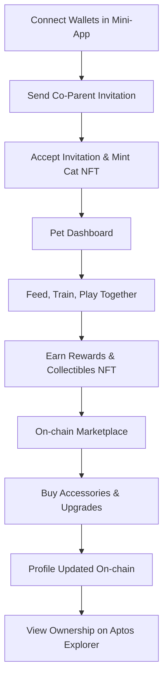

# 🐾 Capy – Aptos Wallet Mini-App: Virtual Pet for Couples

> Adopt and care for a shared digital cat in an Aptos wallet mini-app. First Web3 couples' bonding game with exclusive co-ownership NFTs.

---

## 📖 Table of Contents

* [Overview](#-overview)
* [Why Capy?](#-why-capy)
* [Features](#-features)
* [System Architecture](#-system-architecture)
* [Workflow Diagram](#-workflow-diagram)
* [Business Model](#-business-model)
* [How It Works](#-how-it-works)
* [Tech Stack](#-tech-stack)
* [Roadmap](#-roadmap)
* [Compliance & Safety](#-compliance--safety)
* [Contributing](#-contributing)
* [License](#-license)

---

## 🎮 Overview

Capy is a Web3 couples' game where partners adopt a shared cat NFT, care for it, and unlock collectibles—all in an Aptos wallet mini-app. On-chain NFTs ensure permanent ownership.

---

## 🚀 Why Capy?

Fills Web3's social gap with shared pet ownership.

- **Exclusive Partnerships(anti-cheating feature)**: One pet per couple, enforced by smart contract.
- **Mini-App Innovation**: Seamless wallet integration, no separate app needed.
- **Aptos Scalability**: Fast, low-fee interactions for real-time bonding.
- **Emotional Value**: Turns blockchain into shared memories.

---

## ✨ Features

* **Invite Co-Parent**: Send invitation for exclusive co-ownership (one pet per couple).
* **Adopt Together**: Jointly mint cat NFT.
* **Care & Train**: Feed, play, grow pet attributes.
* **On-chain Marketplace**: Buy accessories with APT.
* **Collectibles**: NFTs with rarity.
* **Shared Rewards**: Couple-exclusive unlocks.
* **Subscription**: Premium access to rares.

---

## 🏗 System Architecture

Pixelised UX with Web3 backend, wallet-optimized.

**Components:**
1. **Frontend**: Next.js + Tailwind (wallet-embedded).
2. **Blockchain**: Aptos/Move for NFTs and co-ownership.
3. **Wallets**: Petra integration.

---

## 🔄 Workflow Diagram

---

## 💰 Business Model

1. **Subscription**: Premium unlocks with APT payments.
2. **Marketplace Fees**: 2-5% on NFT sales.
3. **NFT Drops**: Seasonal rares for engagement.

---

## 🛠 How It Works

1. **Launch Mini-App**: Open in Aptos wallet.
2. **Invite Partner**: Contract ensures unique pair.
3. **Adopt Pet**: Mint shared NFT (one per couple).
4. **Care Together**: Feed, train, play.
5. **Earn NFTs**: Through challenges.
6. **Marketplace**: Trade with APT.
7. **Verify**: On Aptos Explorer.

---

## ⚙ Tech Stack

* **Frontend**: Next.js 14, TailwindCSS
* **Blockchain**: Aptos, Move contracts
* **Wallets**: Petra
* **Deployment**: Vercel

---

## 🔒 Compliance & Safety

* **Non-Custodial**: Users own NFTs.
* **Transparent**: Verifiable on Explorer.
* **Privacy**: Consent-based interactions.
* **Sustainable**: Subscription model.

---

## 🤝 Contributing

1. Fork repo
2. Create branch: `git checkout -b feature/new-feature`
3. Commit: `git commit -m 'Add feature'`
4. Push: `git push origin feature/new-feature`
5. Open PR

---

## 📄 License

MIT License. See [LICENSE](LICENSE) for details.
